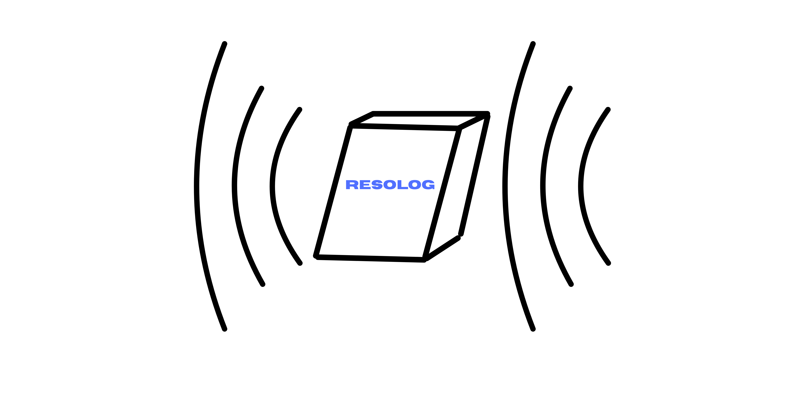
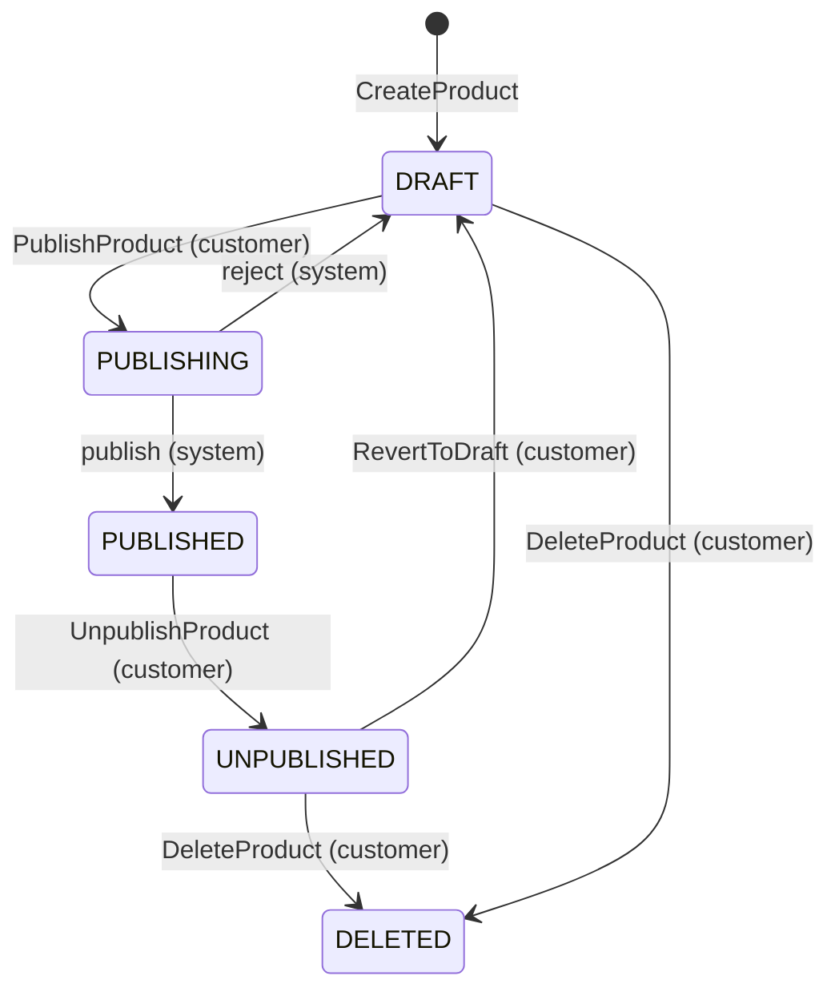

# resolog

## Introduction

resolog comes from resonance and catalog. It comes from the noise that happens when an event is put in the catalog, and
how that ends up with every listener.

It is an event-driven backend service for a music product catalog. Built using Java, Spring Boot, Kafka, Redis, and
MariaDB for persistence. It exposes a RESTful API for managing music products and publishes domain events through Kafka,
when state changes occur in the catalog. Publishing to external platforms (Spotify, Apple Music) and content moderation
beyond logging are out of scope.

## Architectural decisions

### Model

An `Artist` is the entity that represents a person or group that created the music product. It contains the artist's
name, biography and label.

A `Track` is the data model that holds the metadata and audio content of a music product. It contains the artists that
are featured on the track, the track duration, the track number, and the title.

Each music product can be of type `Album`, `EP` or `Single`. An `Album` and `EP` is a collection of tracks, while a 
`Single` is one `Track`, although not enforced in the model. A music product also holds the release date, genre and
most importantly the publishing status of that product. The publishing lifecycle follows a simple state machine.

Upon creation the music product starts in a `DRAFT` status. After the updates, a customer can decide to delete
it, bringing it to a `DELETED` status, or submit a request to publish it. Upon submission, the system would set
its  status to `PUBLISHING`. Customers will poll this status waiting for it to become `PUBLISHED`.

If the validations fail, the system will reject the submission and revert the status back to `DRAFT`. The customer will
be provided with the reason of rejection. If the submission succeeds, it will be set to `PUBLISHED`. A musical product
can also be taken down from the catalog. A `PUBLISHED` status allows the customer to take down the music product,
prompting the system to mark the status to `UNPUBLISHED`. From here the customer can revert it back to `DRAFT`, or
`DELETE` the musical product entirely. A `DELETED` product acts as a soft delete in order to preserve it for auditing
purposes.

### Infrastructure

Optimistic locking through `@Version` on the models prevents lost updates from concurrent requests on the same entity.

## What I would do differently

* Even though in-service concurrent requests are handled from UPDATE clashes through @Version, updates from clients
working with stale data versions are not. To fix this I would add ETags to the service's responses, and then let the
server validate the If-Match header.
