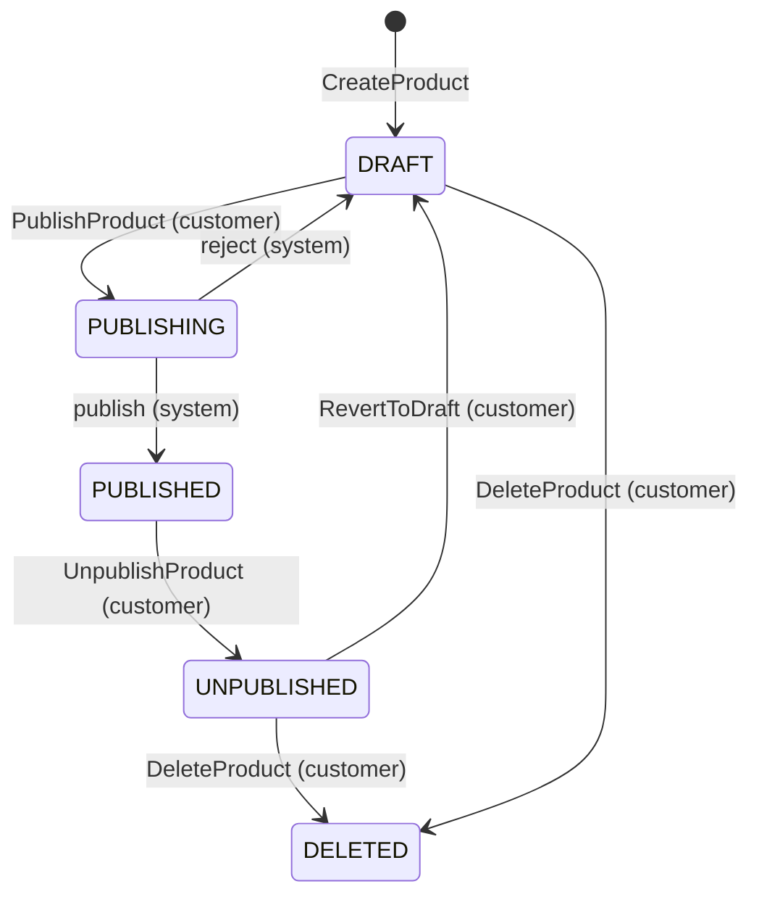
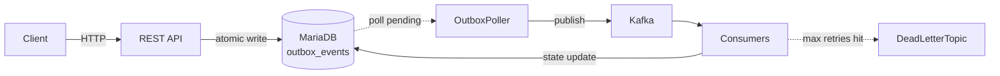
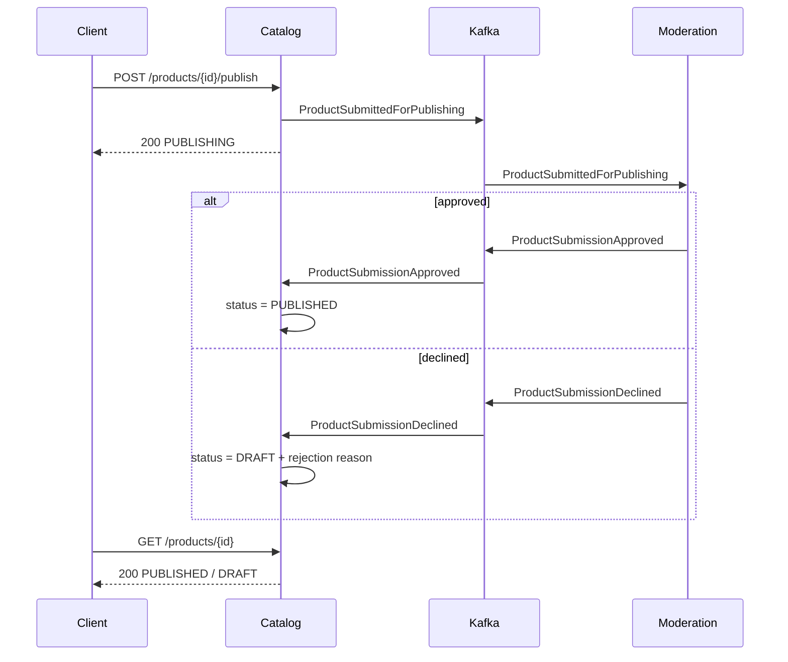

# resolog

## Introduction

resolog comes from resonance and catalog. It comes from the noise that happens when an event is put in the catalog, and
how that ends up with every listener.

It is an event-driven backend service for a music product catalog. Built using Java, Spring Boot, Kafka, and
MariaDB for persistence. It exposes a RESTful API for managing music products and publishes domain events through Kafka,
when state changes occur in the catalog. 

## How to run

### Requirements

* Java 21
* Docker

### Running the application

```bash
docker-compose up
```

Once up, the root endpoint is available at http://localhost:8080

Swagger UI: http://localhost:8080/swagger-ui.html

For the full list of available endpoints, check the [API documentation](#api-design) or the generated Swagger UI.

### Running the tests

```bash
mvnw test
```

#### What is tested

* The domain model is tested through unit tests with Junit
* The service layer and controller is tested through integration tests with @SpringBootTest and MockMvc
* The Kafka consumers are tested through unit tests

**Note:** The integration tests are not exhaustive and do not test end-to-end flow.

## Architectural decisions

### Model

An `Artist` is the entity that represents a person or group that created the music product. It contains the artist's
name, biography, and label.

A `Track` is the data model that holds the metadata and audio content of a music product. It contains the artists that
are featured on the track, the track duration, the track number, and the title.

Each music product can be of type `Album`, `EP` or `Single`. An `Album` and `EP` is a collection of tracks, while a 
`Single` is one `Track`, although not enforced in the model. A music product also holds the release date, genre, and
most importantly the publishing status of that product. The publishing lifecycle follows a simple state machine.

Upon creation the music product starts in a `DRAFT` status. This is the only state which allows data modification.
After the updates, a customer can decide to delete it, bringing it to a `DELETED` status, or submit a request to publish
 it. Upon submission, the system would set its  status to `PUBLISHING`. Customers will poll this status waiting for it 
to become `PUBLISHED`.

If the validations fail, the system will reject the submission and revert the status back to `DRAFT`. The customer will
be provided with the reason of rejection. If the submission succeeds, it will be set to `PUBLISHED`. A musical product
can also be taken down from the catalog. A `PUBLISHED` status allows the customer to take down the music product,
prompting the system to mark the status to `UNPUBLISHED`. From here the customer can revert it back to `DRAFT`, or
`DELETE` the musical product entirely. A `DELETED` product acts as a soft delete in order to preserve it for auditing
purposes. Optimistic locking through `@Version` prevents lost updates from concurrent requests on the same entity.



#### Business Rules

* A product can only be modified while in `DRAFT` status. Any attempt to update a product that is not in `DRAFT` will be
rejected. This applies to artist management as well. They can only be added or removed while the product is editable.

* A product must have at least one artist at creation time. An artist on the other hand can exist independently without 
being associated with any product.

* A product can only be published if it has at least one track.

* Featured artists on a track are a separate relationship from the product's main artists and are managed independently.
A featured artist on a track does not need to be a main artist on the product.

* A product can only be deleted when it's in `DRAFT` or `UNPUBLISHED` status. A published product must first be taken
down before it can be deleted.

* A null price is allowed, but the validation is not enforced until submission.

* Track numbers must be sequential starting from one.

* There is no upper bound on track duration.

* An artist needs to be removed from all products and tracks before it can be deleted. This is to prevent orphaned data.

### API Design

#### Overview

The API is RESTful for creation, reads, data mutation, and deletion. There are operation-oriented endpoints for actions
that have side effects, such as, state transitions and relationship management between entities.

All mutating operations return the updated resource to the requester to save a follow-up GET. State transitioning
operations should be polled while they are processed asynchronously.

#### Artists

The `Artist` is the first entity that need to be created in order to create a music product. The name field is mandatory
, while the label and bio can be added later. The `Artist` can exist as a main contributor on a music product, or as a 
featured artist on a `Track`.

| Method | Path | Description   |
|--------|------|---------------| 
| GET | /artists | List artists  |
| GET | /artists/{id} | Get artist by ID |
| POST | /artists | Create artist |
| PATCH | /artists/{id} | Update artist fields |
| DELETE | /artists/{id} | Delete artist |

#### Products

Products are the core entity of the catalog. The `Product` follows a strict state transitioning mechanism, enforced at
the domain level entirely. When a client calls `/publish`, the status of it transitions to `PUBLISHING`, which triggers
an event, which will validate if the `Product` can be published or not. During this time, clients can poll using
`GET /products/{id}`. Any update call when the `Product` is not in `DRAFT` status will be rejected. 

Deleted products are soft deleted and excluded from all API responses. The `DELETED` status is internal and not exposed.

It also allows the add or removal of main artists, through `POST /products/{id}/artists`, respectively 
`POST /products/{id}/artists/remove`.

| Method | Path | Description   |
|--------|------|---------------|
| GET | /products | List active products |
| GET | /products/{id} | Get product by ID |
| POST | /products | Create product |
| PATCH | /products/{id} | Update product fields |
| DELETE | /products/{id} | Delete product|
| POST | /products/{id}/publish | Submit for publishing |
| POST | /products/{id}/unpublish | Unpublish product |
| POST | /products/{id}/revert | Revert to draft |
| POST | /products/{id}/artists | Add artists to product |
| POST | /products/{id}/artists/remove | Remove artists from product |

#### Tracks

Tracks are always accessed in the context of a product (`/products/{id}/tracks`). Track responses
include a `productId` reference rather than the full product, since the caller already has that context
from the URL.

Featured artists on a track are distinct from the product's main artists and are managed separately
via `POST /products/{productId}/tracks/{id}/featured-artists` for creation, and 
`POST /products/{productId}/tracks/{id}/featured-artists/remove` for deletion.

| Method | Path | Description   |
|--------|------|---------------|
| GET | /products/{id}/tracks | List tracks for product |
| GET | /products/{id}/tracks/{trackId} | Get track by Id |
| POST | /products/{id}/tracks | Create track  |
| PATCH | /products/{id}/tracks/{trackId} | Update track fields |
| DELETE | /products/{id}/tracks/{trackId} | Delete track  |
| POST | /products/{id}/tracks/{trackId}/featured-artists | Add featured artists to track |
| POST | /products/{id}/tracks/{trackId}/featured-artists/remove | Remove featured artists from track |

### Event-Driven Architecture

A music catalog is not an isolated system. When a product is published, a DSP platform needs to know. When a product is
rejected, the customer should be notified. When a product is deleted, it should be archived. These events could take a
long time to complete and cause the clients to wait indefinitely. Rather than coupling the catalog to each of these
systems directly, every meaningful state change produces a domain event that interested listeners can react to
independently.

#### Producing events

Publishing an event directly to Kafka within the same request as the database write means operating across two separate
systems atomically, which is not possible. If the application crashes after the database write but before the Kafka
publishing, the event is lost and the rest of the system never finds out about the change.

To solve this, we use the Outbox Pattern. Events are written to an `outbox_events` table within the same database
transaction as the domain change. A separate job reads pending outbox records and publishes them to Kafka, then marks
these events as delivered. If the application crashes before publishing, the record remains as `PENDING` in the outbox
and the job picks it up on the next cycle. This makes sure that the event is not lost and any faults are handled
gracefully.



#### Consuming events

Because this is a pull-based system, the consumer is responsible for incrementing the offset in the queue. By default,  
Kafka uses auto-incrementing offsets, which means that the consumer will always increment the offset after reading a
message. This is not ideal for our use case, since if the message is read, it does not mean that the consumer has
finished processing it successfully. To handle this, we disable auto-incrementing and manually commit the offset if
the message is successfully processed, and not just on consumer returns, since that could also skip a message if the
consumer throws an exception.

A consumer may also receive the same message more than once. To ensure we haven't processed the same message twice, 
we send the message id from the poller to the consumer through the message header, and the consumer checks if it has
already processed the message by checking the database. When the consumer successfully processes the message, it saves 
the message id to the database and commits the offset.

If a message keeps failing after all retry attempts, it is moved to a Dead Letter Topic so it does not block the rest of
the queue. From there it can be inspected and replayed once the underlying issue is resolved.

#### Publishing workflow

When a customer submits a product for publishing, the status transitions to `PUBLISHING` and a
`ProductSubmittedForPublishing` event is produced. The content moderation consumer picks it up and validates the
submission, verifying that the product has at least one track, that all URLs are valid, and that track numbers are
sequential starting from one. Based on the result, it produces either a `ProductSubmissionApproved` or a
`ProductSubmissionDeclined` event. The catalog consumes that result and transitions the product to `PUBLISHED` or back
to `DRAFT` with a rejection reason. The customer polls `GET /products/{id}` while the process completes asynchronously.



#### Unpublishing product workflow

When a customer requests to take down a product, a `ProductUnpublished` event is produced. A stub consumer reads the
event and notifies the DSP platform about the change. The product is marked as `UNPUBLISHED` and the customer can revert
it to `DRAFT` or delete it entirely.

#### Deleting a product workflow

When a customer requests to delete a product, the status transitions to `DELETED` and a `ProductDeleted` event is
produced. A stub consumer reads the event and would archive the product in a data lake or similar.

#### Creating a product workflow

When a customer creates a product, a `ProductCreated` event is produced. A stub consumer reads the event and logs it
for analytical purposes.

## What I would do differently / or if I had more time

* Support pagination as our catalog grows.

* Redis caching for performance.

* Extensive unit and integration tests that cover all business logic and edge cases. 

* Even though in-service concurrent requests are handled from UPDATE clashes through '@Version', updates from clients
working with stale data versions are not. To fix this, I would add ETags to the service's response, and enforce
clients to send the If-Match header on update requests. On the creation side, I would also add a `Idempotency-Key`
header to the request, and enforce unique-ness data rules to prevent duplicate creation.

* The following product publishing model follows the principle of once it's published, then you would have to take it
 down to perform updates. A future version would allow updates of the product while live.

* API versioning in case of breaking changes.

* Append OpenTelemetry trace id to Kafka message header to distribute it across consumers. This would help
with the gathering of logs and debugging.

* Configure a trace backend server to record the spans of each call across all distributed systems (AWS X-Ray UI style).

* Services should've been passed as interfaces, rather than their implementation, to follow DIP.

* The current idempotency mechanism of the consumers is not robust enough, since two consumers could read the same
message exactly at the same time. A future version would use a database level lock to prevent this, but that also
requires a more complex architecture.

* Use Debezium to capture changes in the database and publish them to Kafka.

* Validate at update time that a product could publish successfully. This would offer a better UX.

* Create an audit table to track all changes made to the catalog. This would help with auditing and debugging.

* Add operation Admin endpoints to manage the DLT.