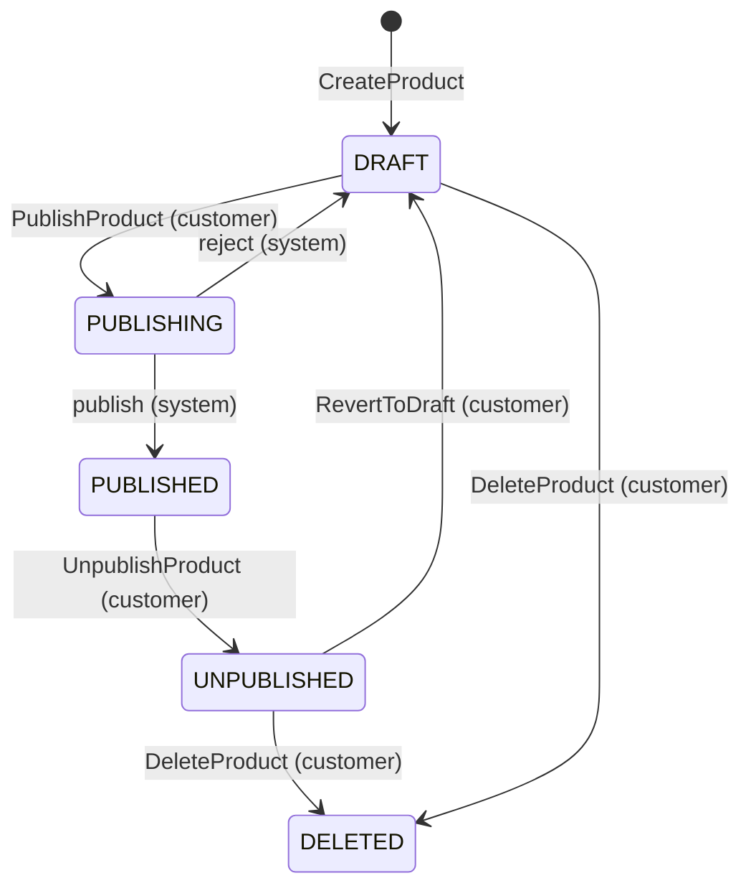

# resolog

## Introduction

resolog comes from resonance and catalog. It comes from the noise that happens when an event is put in the catalog, and
how that ends up with every listener.

It is an event-driven backend service for a music product catalog. Built using Java, Spring Boot, Kafka, Redis, and
MariaDB for persistence. It exposes a RESTful API for managing music products and publishes domain events through Kafka,
when state changes occur in the catalog. Publishing to external platforms (Spotify, Apple Music) and content moderation
beyond logging are out of scope.

## Architectural decisions

### Model

An `Artist` is the entity that represents a person or group that created the music product. It contains the artist's
name, biography and label.

A `Track` is the data model that holds the metadata and audio content of a music product. It contains the artists that
are featured on the track, the track duration, the track number, and the title.

Each music product can be of type `Album`, `EP` or `Single`. An `Album` and `EP` is a collection of tracks, while a 
`Single` is one `Track`, although not enforced in the model. A music product also holds the release date, genre and
most importantly the publishing status of that product. The publishing lifecycle follows a simple state machine.

Upon creation the music product starts in a `DRAFT` status. This is the only state which allows data modification.
After the updates, a customer can decide to delete it, bringing it to a `DELETED` status, or submit a request to publish
 it. Upon submission, the system would set its  status to `PUBLISHING`. Customers will poll this status waiting for it 
to become `PUBLISHED`.

If the validations fail, the system will reject the submission and revert the status back to `DRAFT`. The customer will
be provided with the reason of rejection. If the submission succeeds, it will be set to `PUBLISHED`. A musical product
can also be taken down from the catalog. A `PUBLISHED` status allows the customer to take down the music product,
prompting the system to mark the status to `UNPUBLISHED`. From here the customer can revert it back to `DRAFT`, or
`DELETE` the musical product entirely. A `DELETED` product acts as a soft delete in order to preserve it for auditing
purposes.

### API Design

#### Overview

The API is RESTful for creation, reads, data mutation and deletion. There are operation oriented endpoints for actions
that have side effects, such as, state transitions and relationship management between entities.

All mutating operations return the updated resource back to the requester in order to save a following GET. State
transitioning operations should be polled while they are processed asynchronously.

#### Artists

The `Artist` is the first entity that need to be created in order to create a music product. The name field is mandatory
, while the label and bio can be added later. The `Artist` can exist as a main contributor on a music product, or as a 
featured artist on a `Track`.

| Method | Path | Description   |
|--------|------|---------------| 
| GET | /artists | List artists  |
| GET | /artists/{id} | Get artist by ID |
| POST | /artists | Create artist |
| PATCH | /artists/{id} | Update artist fields |
| DELETE | /artists/{id} | Delete artist |

#### Products

Products are the core entity of the catalog. The `Product` follows a strict state transitioning mechanism, enforced at
the domain level entirely. When a client calls `/publish`, the status of it transitions to `PUBLISHING`, which triggers
an event, which will validate if the `Product` can be published or not. During this time, clients can poll using
`GET /products/{id}`. Any update call when the `Product` is not in `DRAFT` status will be rejected. 

Deleted products are soft deleted and excluded from all API responses. The `DELETED` status is internal and not exposed.

It also allows the add or removal of main artists, through `POST /products/{id}/artists`, respectively 
`POST /products/{id}/artists/remove`.

| Method | Path | Description   |
|--------|------|---------------|
| GET | /products | List active products |
| GET | /products/{id} | Get product by ID |
| POST | /products | Create product |
| PATCH | /products/{id} | Update product fields |
| DELETE | /products/{id} | Delete product|
| POST | /products/{id}/publish | Submit for publishing |
| POST | /products/{id}/unpublish | Unpublish product |
| POST | /products/{id}/revert | Revert to draft |
| POST | /products/{id}/artists | Add artists to product |
| POST | /products/{id}/artists/remove | Remove artists from product |

#### Tracks

Tracks are always accessed in the context of a product (`/products/{id}/tracks`). Track responses
include a `productId` reference rather than the full product, since the caller already has that context
from the URL.

Featured artists on a track are distinct from the product's main artists and are managed separately
via `POST /products/{productId}/tracks/{id}/featured-artists` for creation, and 
`POST /products/{productId}/tracks/{id}/featured-artists/remove` for deletion.

| Method | Path | Description   |
|--------|------|---------------|
| GET | /products/{id}/tracks | List tracks for product |
| GET | /products/{id}/tracks/{trackId} | Get track by Id |
| POST | /products/{id}/tracks | Create track  |
| PATCH | /products/{id}/tracks/{trackId} | Update track fields |
| DELETE | /products/{id}/tracks/{trackId} | Delete track  |
| POST | /products/{id}/tracks/{trackId}/featured-artists | Add featured artists to track |
| POST | /products/{id}/tracks/{trackId}/featured-artists/remove | Remove featured artists from track |

### Infrastructure

Optimistic locking through `@Version` on the models prevents lost updates from concurrent requests on the same entity.

## What I would do differently

* Even though in-service concurrent requests are handled from UPDATE clashes through @Version, updates from clients
working with stale data versions are not. To fix this I would add ETags to the service's responses, and then let the
server validate the If-Match header.

* I would enforce a business logic rule that prevents the same `Product`(`Product.title`, `Product.type`), `Artist` and 
`Artist.label` from being created. Also adding `Idempotency-Key` support for flaky network requests.

* The following product publishing model follows the principle of once it's published, then you would have to take it
down, in order to perform updates. A future version would allow atomic updates of the product while live.
